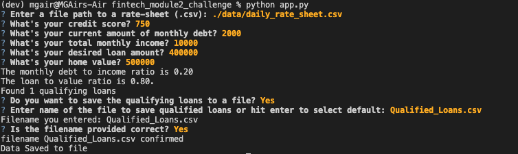

# Loan Qualifier App

The application helps the user to generate a list of banks that would accept the home loan application based on input criteria.

- Credit Score
- Monthly Income
- Home Value
- Monthly Debt
- Loan amount

#### The inputs are evaluated against a set of criteria submitted by various banks. The data provided by the banks are included in daily_rate_sheet.csv
---

## Technologies

The program is based on Python 3 and require the following libraries/packages to function

- fire
- questionary

---

## Installation Guide

The user of the application will have to download Python,   Python package manager PIP and Git.

   - [How to install Python](https://www.python.org/downloads/) 
   - [How to install PIP ](https://pip.pypa.io/en/stable/installation/) 
   - [How to install Git ](https://git-scm.com/book/en/v2/Getting-Started-Installing-Git) 
   
   Once you have installed Python and PIP, you can install Questionary and Fire packages 
   > pip install questionary  
   > pip install fire  
   

---

## Usage

To use the application, follow the steps below.

1. Download the files from Github
    > mkdir Loan_Qualifer  
    > git clone https://github.com/devops4cloud/fintech_module2_challenge.git  
    > cd fintech_module2_challenge

2. Run python app.py on terminal

3. Enter the location of the file containing loan infomation from Banks (daily_rate_sheet.csv)

4. Enter the loan information: Credit Score, Monthly Income, Home Value, Monthly Debt, Loan amount

5. Enter a file name to save qualifying loans to

### Sample Execution

The following image shows the end-to-end execution of the program

---

## Contributors

This application is developed by Mario G.

---

## License

Copyright: N/A
